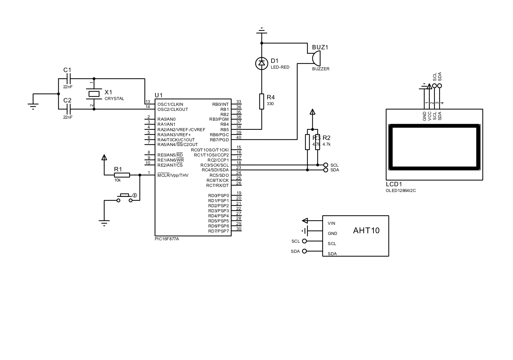

# PIC16F877A with AHT10 & OLED

A project demonstrating how to read temperature and humidity from an AHT10 sensor using a PIC16F877A and display the results on an I2C OLED display. This project is written in C for the **CCS C Compiler**.

## Features

* Reads real-time temperature (in Celsius °C).
* Reads real-time relative humidity (in %).
* Displays the data clearly on a 128x64 OLED screen.
* Written in C and compiled with the CCS C Compiler.
## Schematic
* Below is a preview of the schematic of the circuit drawn in Proteus.
   * **Schematic:**     
## 💻 Software & Tools

* **IDE/Compiler:** CCS C Compiler IDE (v5.025)
* **Libraries:**
    * **SSD1306 OLED Driver:** This project uses a third-party SSD1306 driver library.
    * **Source:** The library was obtained from (http://simple-circuit.com/). The original library files are included in this web site.
